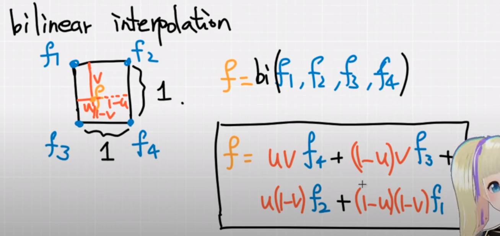

# Introduction

- pytorch -> C++ -> CUDA
- pybind: call C++ from python
- CUDA GPU architechture


- CUDA: grid -> block->thread
- 为什么要有block这个中间层?
  - block 上限： $(2^{31}-1)*2^{16}*2^{16}$
  - Thread上限: 1024

# Environment Building

- ``conda create -n cppcuda python=3.8``

- ``conda activate cppcuda``

- Install [pytorch](https://pytorch.org/get-started/locally/)

  - ```
    python -m pip install pip -U
    pip3 install torch torchvision torchaudio
    ```

-  pytorch path

  - how to check path
   ```sh
    import torch
    print(torch.__file__)
   ```

  - path example:
  ```sh
  "/usr/include/python3.8",
  "/home/.local/lib/python3.8/site-packages/torch/include/",
  "/home/.local/lib/python3.8/site-packages/torch/include/torch/csrc/api/include"
  ```

- Python setup Example for CppExtension

```python
from setuptools import setup
from torch.utils.cpp_extension import BuildExtension, CppExtension

setup(
    name='cppcuda_tutorial',
    version='1.0',
    author='qingbao',
    author_email='<EMAIL>',
    description='cppcuda example',
    long_description='A tutorial for using C++ and CUDA in PyTorch',
    long_description_content_type='text/markdown',
    ext_modules=[
        CppExtension(
           name='cppcuda_tutorial',
           sources=['interplation.cpp']),
    ],
    cmdclass={
        'build_ext': BuildExtension},
)
```

# General use case

- non parallel computation, e.g. volume rendering
- lots of sequential computation

# Example: linear interpolation

## Bilinear interpolation



## Trilinear interpolation

- Input
  - feats: (N, 8, F)
    - N: 多少个volume
    - 8： 8个顶点
    - F: 每个顶点的特征
- Output
  -  points: (N, 3) 差值后的点
- 平行运算：
  - N个点
  - F平行

- 如何计算block大小


```python
const int N = feats.size(0);
const int F = feats.size(2);

// torch::zeros({N, F}, torch::dtype(torch::kInt32).device(feats.device()));
torch::Tensor feat_interp = torch::zeros({N, F}, feats.options());

const dim3 threads(16, 16); // max threads:256, two dimension, each use 16 threads
const blocks((N + threads.x -1)/threads.x, (F + threads.y -1)/threads.y);
```

# Issues

- unsupported clang version

```sh
/usr/local/cuda/bin/../targets/x86_64-linux/include/crt/host_config.h:151:2:
[cmake]   error: -- unsupported clang version! clang version must be less than 16 and
[cmake]   greater than 3.2 .  The nvcc flag '-allow-unsupported-compiler' can be used
[cmake]   to override this version check; however, using an unsupported host compiler
[cmake]   may cause compilation failure or incorrect run time execution.  Use at your
[cmake]   own risk.
[cmake] 
[cmake]     151 | #error -- unsupported clang version! clang version must be less than 16 and greater than 3.2 . The nvcc flag '-allow-unsupported-compiler' can be used to override this version check; however, using an unsupported host compiler may cause compilation failure or incorrect run time execution. Use at your own risk.
[cmake]         |  ^
[cmake] 
[cmake]   1 error generated.
```

Solution:

Use clang less than 16.

```sh
set(CMAKE_C_COMPILER   /usr/bin/clang-13)
set(CMAKE_CXX_COMPILER /usr/bin/clang++-13)
```

- Failed to initialize NumPy

```sh
.local/lib/python3.8/site-packages/torch/nn/modules/transformer.py:20: UserWarning: Failed to initialize NumPy: numpy.core.multiarray failed to import (Triggered internally at ../torch/csrc/utils/tensor_numpy.cpp:84.)
  device: torch.device = torch.device(torch._C._get_default_device()),  # torch.device('cpu'),
```

Solution:

```sh
python -m pip install pip -U
```

- setuptools

```sh
_check_cuda_version(compiler_name, compiler_version)
File "/home/qingbao/.local/lib/python3.8/site-packages/torch/utils/cpp_extension.py", line 411, in _check_cuda_version
raise ValueError("setuptools>=49.4.0 is required")
ValueError: setuptools>=49.4.0 is required
```


# References

- [Pytorch+cpp/cuda extension 教學 tutorial 1](https://www.youtube.com/watch?v=l_Rpk6CRJYI&ab_channel=AI%E8%91%B5)
- https://docs.nvidia.com/cuda/cuda-c-programming-guide/index.html#features-and-technical-specifications__technical-specifications-per-compute-capability
- https://github.com/kwea123/pytorch-cppcuda-tutorial

